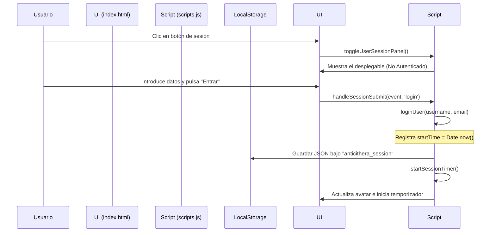
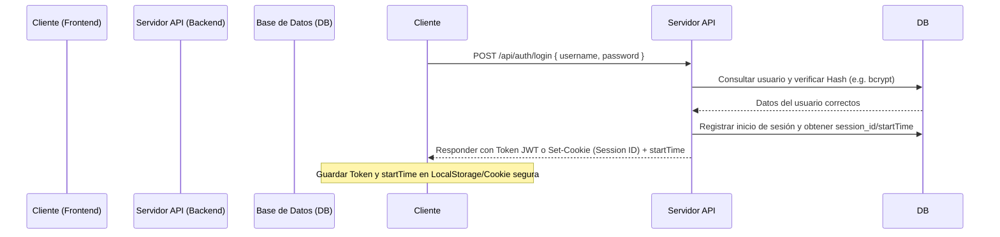

# Documentación de Gestión de Sesión (Anticithera)

Este documento detalla el funcionamiento del sistema de sesión simulado implementado en la interfaz de **Anticithera**, explicando la estructura de almacenamiento actual y cómo migrar este diseño a una arquitectura cliente-servidor persistida en base de datos.

---

## 1. Arquitectura Actual (Simulada / Cliente)

Actualmente, toda la gestión de la sesión ocurre en el **lado del cliente** mediante JavaScript de forma reactiva y persistencia local.



### Dónde se guarda la información
El estado se guarda en la clave `anticithera_session` del **LocalStorage** del navegador. Los datos almacenados tienen la siguiente estructura:

```json
{
  "username": "Cristopher",
  "email": "cristopher@example.com",
  "startTime": 1779212345678
}
```
* **username**: Identificador visual del usuario.
* **email**: Correo de la sesión.
* **startTime**: Marca de tiempo en milisegundos (`Date.now()`) que define el inicio exacto de la sesión para poder calcular el tiempo transcurrido de forma correcta incluso si la pestaña se refresca.

---

## 2. Flujo de Control en JavaScript (`scripts.js`)

La lógica está modularizada a través de las siguientes funciones clave:

### A. Inicialización y Persistencia (`checkActiveSession`)
Cuando la página carga, la función `checkActiveSession()` busca el objeto en el almacenamiento del navegador. Si existe, restaura el estado cargándolo en memoria e iniciando el temporizador.
```javascript
function checkActiveSession() {
    const saved = localStorage.getItem('anticithera_session');
    if (saved) {
        try {
            userSession = JSON.parse(saved);
            updateSessionUI();
        } catch (e) {
            localStorage.removeItem('anticithera_session');
        }
    }
}
```

### B. Temporizador Dinámico (`startSessionTimer` / `updateTimerText`)
En lugar de almacenar un contador numérico de segundos (el cual se reiniciaría al refrescar la página), el tiempo transcurrido se calcula dinámicamente obteniendo la diferencia horaria entre el momento actual (`Date.now()`) y el `startTime` original:
$$\text{Tiempo Transcurrido} = \text{Date.now()} - \text{startTime}$$

```javascript
function updateTimerText() {
    if (!userSession) return;
    const diffMs = Date.now() - userSession.startTime;
    const diffSecs = Math.floor(diffMs / 1000);
    const secs = String(diffSecs % 60).padStart(2, '0');
    const mins = String(Math.floor(diffSecs / 60) % 60).padStart(2, '0');
    const hours = String(Math.floor(diffSecs / 3600)).padStart(2, '0');
    document.getElementById('sessionTimer').innerText = `${hours}:${mins}:${secs}`;
}
```

---

## 3. Hoja de Ruta para Implementación Real (Base de Datos)

Para convertir esta simulación en un sistema real y seguro con base de datos, deberás realizar la transición a un modelo **Cliente-Servidor**.

### A. Arquitectura Recomendada (JWT o Cookies de Sesión)



### B. Diseño de Tabla en Base de Datos (Ejemplo SQL)

Debes tener al menos dos tablas para gestionar usuarios y sus correspondientes registros de conexión (para contabilizar el tiempo de sesión de forma persistente e histórica):

```sql
-- Tabla de Usuarios
CREATE TABLE usuarios (
    id SERIAL PRIMARY KEY,
    username VARCHAR(50) UNIQUE NOT NULL,
    email VARCHAR(100) UNIQUE NOT NULL,
    password_hash VARCHAR(255) NOT NULL,
    created_at TIMESTAMP DEFAULT CURRENT_TIMESTAMP
);

-- Tabla para Historial/Seguimiento de Sesiones
CREATE TABLE sesiones_actividad (
    id SERIAL PRIMARY KEY,
    usuario_id INT REFERENCES usuarios(id) ON DELETE CASCADE,
    token_sesion VARCHAR(255) UNIQUE NOT NULL,
    inicio_conexion TIMESTAMP DEFAULT CURRENT_TIMESTAMP,
    fin_conexion TIMESTAMP,
    duracion_segundos INT -- Se computa al hacer logout
);
```

### C. Cambios requeridos en el Frontend (`scripts.js`)

1. **Petición de Red (`Fetch`)**:
   Reemplazar la función local `loginUser()` por una llamada HTTP asíncrona hacia tu servidor backend:
   ```javascript
   async function loginUser(username, password) {
       try {
           const response = await fetch('https://tu-api.com/api/auth/login', {
               method: 'POST',
               headers: { 'Content-Type': 'application/json' },
               body: JSON.stringify({ username, password })
           });
           
           if (!response.ok) throw new Error('Credenciales inválidas');
           
           const data = await response.json(); 
           // data debe contener: { token, username, email, startTime }
           
           userSession = {
               token: data.token,
               username: data.username,
               email: data.email,
               startTime: new Date(data.startTime).getTime()
           };
           
           localStorage.setItem('anticithera_session', JSON.stringify(userSession));
           updateSessionUI();
       } catch (error) {
           showToast(error.message);
       }
   }
   ```

2. **Cierre de sesión persistente (Logout)**:
   Al presionar "Cerrar Sesión", no basta con borrar el `localStorage`; se debe avisar al servidor para registrar el fin de la sesión (`fin_conexion`) y calcular la duración final:
   ```javascript
   async function logoutSession() {
       if (userSession && userSession.token) {
           await fetch('https://tu-api.com/api/auth/logout', {
               method: 'POST',
               headers: { 
                   'Authorization': `Bearer ${userSession.token}`,
                   'Content-Type': 'application/json'
               }
           });
       }
       userSession = null;
       localStorage.removeItem('anticithera_session');
       updateSessionUI();
   }
   ```
