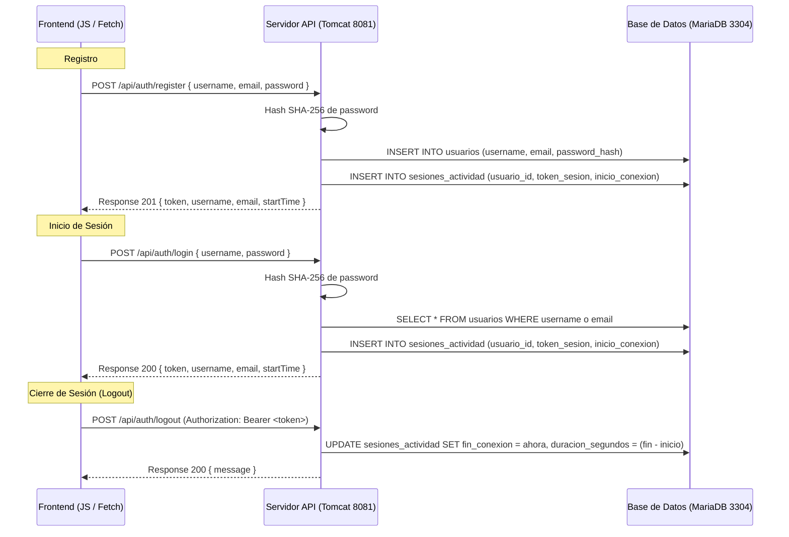

# Documentación de Gestión de Sesión (Anticithera)

Este documento detalla el funcionamiento del sistema de autenticación y gestión de sesiones basado en la API REST de **Jakarta EE** y la base de datos **MariaDB**, migrado desde el sistema de simulación en cliente anterior.

---

## 1. Arquitectura del Sistema (Cliente-Servidor)

El flujo de control se ha descentralizado hacia el servidor de aplicaciones Tomcat y la base de datos MariaDB, garantizando persistencia real, seguridad en contraseñas y registro detallado de las sesiones.



---

## 2. Configuración del Servidor y Base de Datos

### A. Parámetros de Conexión
* **Servidor Tomcat (API)**: Puerto `8081` (Contexto: `/anticithera`)
* **Base de Datos MariaDB**: Puerto `3304`
  * **Usuario**: `root`
  * **Contraseña**: `14980119`
  * **Nombre de base de datos**: `anticithera`

### B. Diseño de Tablas (SQL)
```sql
-- Tabla principal de Usuarios
CREATE TABLE usuarios (
    id SERIAL PRIMARY KEY,
    username VARCHAR(50) UNIQUE NOT NULL,
    email VARCHAR(100) UNIQUE NOT NULL,
    password_hash VARCHAR(255) NOT NULL,
    created_at TIMESTAMP DEFAULT CURRENT_TIMESTAMP
);

-- Tabla para llevar el registro del tiempo de las sesiones
CREATE TABLE sesiones_actividad (
    id SERIAL PRIMARY KEY,
    usuario_id BIGINT UNSIGNED,
    token_sesion VARCHAR(255) UNIQUE NOT NULL,
    inicio_conexion TIMESTAMP DEFAULT CURRENT_TIMESTAMP,
    fin_conexion TIMESTAMP,
    duracion_segundos INT,
    FOREIGN KEY (usuario_id) REFERENCES usuarios(id) ON DELETE CASCADE
);
```

---

## 3. Implementación del Backend (Jakarta EE)

Se ha estructurado la API REST utilizando JAX-RS y persistencia JPA bajo el paquete por defecto del proyecto.

### A. Configuración de Persistencia (`persistence.xml`)
Ubicación: `src/conf/persistence.xml`. Define la unidad de persistencia `AnticitheraPU` enlazada con la base de datos MariaDB:
```xml
<?xml version="1.0" encoding="UTF-8"?>
<persistence version="3.0" xmlns="https://jakarta.ee/xml/ns/persistence" ...>
  <persistence-unit name="AnticitheraPU" transaction-type="JTA">
    <jta-data-source>jdbc/anticithera</jta-data-source>
    <class>LibreriaUsuario</class>
    <class>Usuario</class>
    <class>SesionActividad</class>
    <properties>
      <property name="jakarta.persistence.jdbc.driver" value="org.mariadb.jdbc.Driver"/>
      <property name="jakarta.persistence.jdbc.url" value="jdbc:mariadb://localhost:3304/anticithera"/>
      <property name="jakarta.persistence.jdbc.user" value="root"/>
      <property name="jakarta.persistence.jdbc.password" value="14980119"/>
    </properties>
  </persistence-unit>
</persistence>
```

### B. Configuración de Recurso JNDI en Tomcat (`context.xml`)
Ubicación: `web/META-INF/context.xml`. Define la conexión pooling en el servidor:
```xml
<Context path="/anticithera">
  <Resource name="jdbc/anticithera"
            auth="Container"
            type="javax.sql.DataSource"
            driverClassName="org.mariadb.jdbc.Driver"
            url="jdbc:mariadb://localhost:3304/anticithera?useSSL=false&amp;allowPublicKeyRetrieval=true"
            username="root"
            password="14980119"
            maxTotal="20"
            maxIdle="10"
            maxWaitMillis="-1"/>
</Context>
```

### C. Endpoints de Autenticación (`UsuarioResource.java`)
Se exponen las siguientes rutas en el path base `/api/auth`:

1. **`POST /register`**: Crea un nuevo registro en `usuarios`, cifra la contraseña con **SHA-256** mediante `HashUtil` y abre la sesión del usuario.
2. **`POST /login`**: Compara la contraseña cifrada contra el hash en la DB. Si concuerdan, crea un token UUID y lo guarda en `sesiones_actividad`.
3. **`POST /logout`**: Recibe el token mediante la cabecera `Authorization: Bearer <token>`, establece la fecha/hora de salida y calcula la diferencia en segundos (`duracion_segundos`).

### D. Soporte CORS (`CorsFilter.java`)
Se incluye un filtro `@Provider` que intercepta las peticiones y añade las cabeceras CORS (`Access-Control-Allow-Origin: *`, `Methods`, `Headers`), permitiendo que el cliente realice llamadas REST desde cualquier puerto (por ejemplo, Live Server en el puerto 5500) o a través de `file://`.

---

## 4. Integración del Frontend (`scripts.js`)

La constante `API_BASE_URL` detecta el origen de la app o redirige a la instancia Tomcat `http://localhost:8081/anticithera/api`.

### A. Envío de Peticiones de Autenticación
Las peticiones a la API REST envían datos en formato JSON y manejan los tokens y horas de inicio reales de la conexión:
```javascript
// Ejemplo de inicio de sesión real
const response = await fetch(`${API_BASE_URL}/auth/login`, {
    method: 'POST',
    headers: { 'Content-Type': 'application/json' },
    body: JSON.stringify({ username, password })
});
```

### B. Cierre de sesión persistente
Al hacer logout, el frontend consume el endpoint correspondiente enviando el token en la cabecera de autenticación:
```javascript
await fetch(`${API_BASE_URL}/auth/logout`, {
    method: 'POST',
    headers: {
        'Authorization': `Bearer ${userSession.token}`
    }
});
```

---
*Nota: Si el servidor Tomcat está apagado o no responde, el frontend no iniciará sesión simulada; en su lugar, disparará un mensaje emergente de error (`alert`) detallando la URL de la API y el error de conexión para facilitar la depuración inmediata del sistema.*
